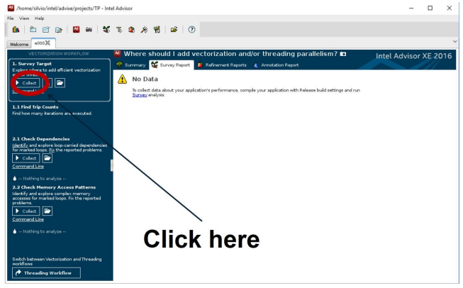
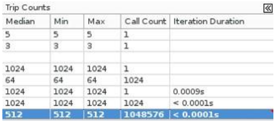
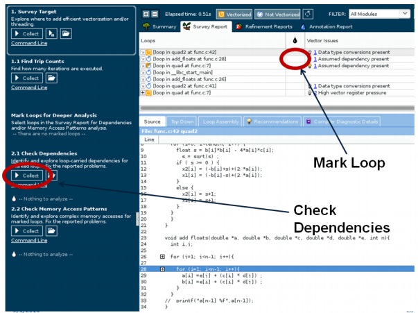

# Hands-on “Vectorization” #

* Vectorization Report
* Intel Advisor
	* Create Advisor Project
	* Collect Survey Data
	* Check Trip Count
	* Check Dependencies
	* Check Memory Access Patterns
	* Test xhost option

**1.** Compile the example with `vec-report6` and `o3`

```
icc func.c -c -vec-report6 -O3 -g
icc vectorization_hands_on.c func.o -o vectorization_hands_on -vec-report6 -O3 -g
```
______

**2.** Open the vectorization report `vectorization_hands_on.optrpt`. Note that the loop on function main was automatically vectorized:

> remark #15300: LOOP WAS VECTORIZED
______

**3.** Open the vectorization report of func `func.optrpt` and note that the loops on function `add_floats` and on function `quad` were not automatically vectorized:

> remark #15344: loop was not vectorized: vector dependence prevents vectorization
______

**4.** Create New Project on Intel Advisor to evaluate the application `vectorization_hands_on` (figures 1 to 4)

* Execute Intel Advisor on terminal: advixe-gui
* create new Advisor Project using the following parameters:
	* Name: vectest
	* Application: `~/hands_on/vectorization/vectorization_hands_on`
	* Source Folder: `~/hands_on/vectorization/`


## Using Intel Advisor XE


**Figure 1.** Main Intel Advisor Window.
______


**Figure 2.** Creating new project.
______


**Figure 3.** Configuring Project.
______


**Figure 4.** Setup search directory.
______

**5.** Start Survey Target Report (figure 5)



**Figure 5.** Survey target report.
______

**6.** Execute Trip Count Analysis (figure 6):

> How many times the loop on function quad2 was executed?



**Figure 6.** Trip count results.
______

**7.** Check dependency of inner loop on function add_floats and on function quad (figure 7).

* Mark Loop for deeper analysis;
* Click on “check dependency”;



**Figure 7.** Check dependency.

Note that no dependencies were found, so It is safe to vectorize the loop.
______

**8.** Include `#pragma ivdep directive` in top of inner loop `for (i=0; i<n; i++)` on function `add_floats`:

```c
#pragma ivdep
for (i=0; i<n; i++){
```
______

**9.** Include keyword `restrict` on all arguments that receives pointers on function `quad` (on `func.c` file):

```c
void quad(int length, double * restrict a, double * restrict b, double * restrict c, double * restrict x1, double * restrict x2)
```
______

**10.** Recompile the example and run survey target again:

```
icc func.c -g -c -vec-report6 -O3 -restrict
icc VectorizationHandson.c -g func.o -o VectorizationHandson -vec-report6 -O3
```

Note that this loop was vectorized.
______

**11.** Check Memory Access Pattern

* Compile file `stride.c`:
```
icc stride.c -o stride -g
```

* Run the application and get the execution time:
```
time ./stride
```

* Mark inner Loop of function main of file `stride.c` for deeper analysis `for(i=0; i<40000; i++)` line 23 ;

* Click on “check dependency”;

* Open the refinement reports (figure 8)


Note that the stride distribution is “constant stride”


**Figure 8.** Refinement report window.
______

**12.** Redesign the structure to SOA (Structure of Arrays) format.

* Change the structure on file stride.c from AOS to SOA using the following code:

```c
struct coordinate {
float x[40000], y[40000], z[40000];
} obj;
```

* Change the body of inner loop on main function:

```c
obj.x[i]=i + randV;
obj.y[i]=i*i+ randV;
obj.z[i]=i+i+ randV;
```

* Change the body of second inner loop on main function:

```c
for(i=0; i<40000; i++) {
obj.x[i]= obj.y[i]+ obj.z[i] + randV;
}
```

* Recompile the application and run the **Check Memory Access Pattern** again. Note that the stride distribution is unit stride now.

* Run the application and get the execution time again:

```
time ./stride
```
Note that the performance may be improved.
______

**13.** Recompile application using AVX.

Using xhost:

```
icc stride.c -o stride -g -O3 -xhost
```

Collect Survey Data again. 

Note that now the code was compiled using AVX.
