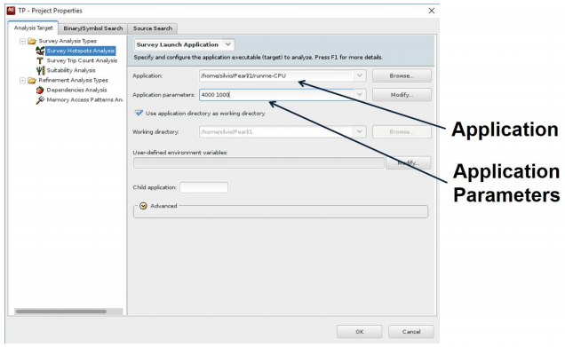
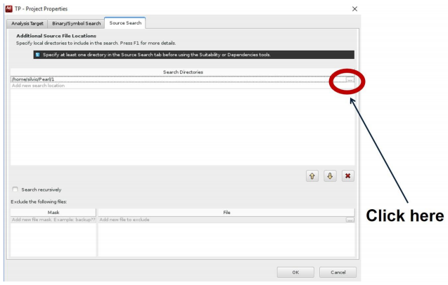

# Hands-on “Vectorization” #

* Vectorization Report
* Intel Advisor
	* Create Advisor Project
	* Collect Survey Data
	* Check Trip Count
	* Check Dependencies
	* Check Memory Access Patterns
	* Test xhost option

**1.** Compile the example with `vec-report6` and `o3`

```
icc func.c -c -vec-report6 -O3 -g
icc vectorization_hands_on.c func.o -o vectorization_hands_on -vec-report6 -O3 -g
```

**2.** Open the vectorization report `vectorization_hands_on.optrpt`. Note that the loop on function main was automatically vectorized:

> remark #15300: LOOP WAS VECTORIZED

**3.** Open the vectorization report of func `func.optrpt` and note that the loops on function `add_floats` and on function `quad` were not automatically vectorized:

> remark #15344: loop was not vectorized: vector dependence prevents vectorization

**4.** Create New Project on Intel Advisor to evaluate the application `vectorization_hands_on` (figures 1 to 4)

* Execute Intel Advisor on terminal: advixe-gui
* create new Advisor Project using the following parameters:
	* Name: vectest
	* Application: `~/hands_on/vectorization/vectorization_hands_on`
	* Source Folder: `~/hands_on/vectorization/`
______

## Using Intel Advisor XE


**Figure 1.** Main Intel Advisor Window.
______


**Figure 2.** Creating new project.
______



**Figure 3.** Configuring Project.
______



**Figure 4.** Setup search directory.
______


